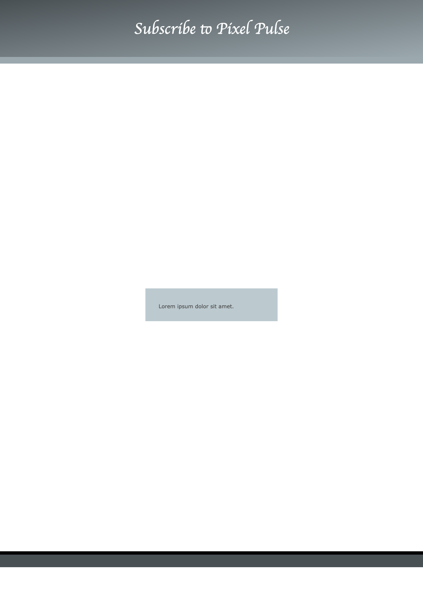

<h2 class="c-project-heading--task">Update the header and footer</h2>

--- task ---
Replace the placeholder heading and remove the footer text so your landing page starts with a clear message.
--- /task ---

Edit the heading and footer area in `index.html`. You can leave the browser tab title as it is.

--- code ---
---
language: html
filename: index.html
line_numbers: true
line_number_start: 24
line_highlights: 26,28-29,40-41
---
  </head>

  <body class="gradientCP"> <!-- Add a class so you can style the whole page background later -->
    <!-- The page header code goes here -->
    <header class="gradient1 border-bottom"> <!-- Use a stronger header style -->
      <h1>Subscribe to Pixel Pulse</h1> <!-- Tell visitors what action you want them to take -->
    </header>

    <!-- The main content for the web page goes between the main tags -->
    <main>
      <section>
      
Lorem ipsum dolor sit amet.

      </section>
    </main>

    <!-- Footer code goes here -->
    <footer class="secondary border-top"> <!-- Keep the footer, but remove the placeholder text -->
    </footer>

  </body>
--- /code ---

--- task ---
**Test:** The page heading should say `Subscribe to Pixel Pulse`, and the old footer text should be gone.
--- /task ---

