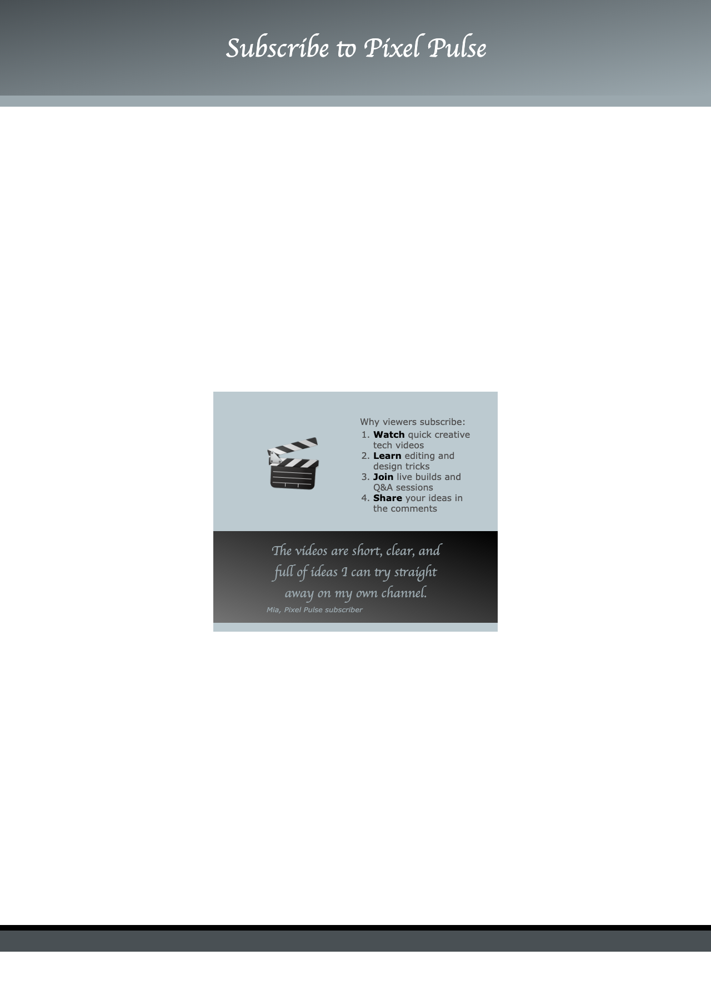

<h2 class="c-project-heading--task">Add a customer quote</h2>

Add a quote section that gives visitors social proof that the channel is worth subscribing to.

<h2 class="c-project-heading--explainer">Follow these instructions</h2>

Paste this section just after the list section and before `</main>` in `index.html`.

--- code ---
---
language: html
filename: index.html
line_numbers: true
line_number_start: 46
line_highlights: 48-53
---
      </section>

      <section class="wrap gradient2">
        

          <blockquote>The videos are short, clear, and full of ideas I can try straight away on my own channel.</blockquote> <!-- Share feedback from a subscriber -->
          <cite>Mia, Pixel Pulse subscriber</cite> <!-- Credit the quote -->
        

      </section>
    </main>
--- /code ---

## Now run your code

A quote should appear underneath the list section with the subscriber's name shown below it.

