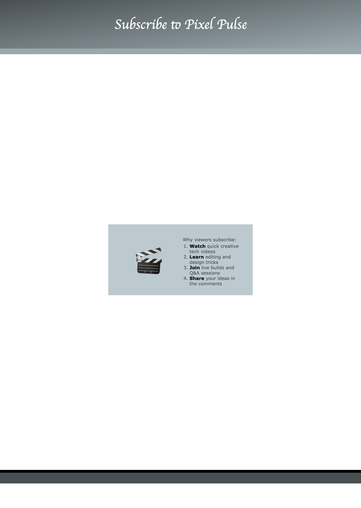

<h2 class="c-project-heading--task">Add a selling list</h2>

--- task ---
Replace the placeholder paragraph with a section that explains why the YouTube channel is worth following.
--- /task ---

Add a wrapped section with a large emoji and an ordered list.

--- code ---
---
language: html
filename: index.html
line_numbers: true
line_number_start: 32
line_highlights: 34-35,37-46
---
    <!-- The main content for the web page goes between the main tags -->
    <main>
      <section class="wrap">
        
🎬
 <!-- Make the emoji stand out and spin -->

        

          
Why viewers subscribe:
 <!-- Introduce the list -->
          <ol>
            <li><strong>Watch</strong> quick creative tech videos</li> <!-- Show the first benefit -->
            <li><strong>Learn</strong> editing and design tricks</li>
            <li><strong>Join</strong> live builds and Q&amp;A sessions</li>
            <li><strong>Share</strong> your ideas in the comments</li>
          </ol>
        

      </section>
    </main>
--- /code ---

--- task ---
**Test:** You should see a large emoji next to a four-point list explaining what viewers get from the channel.
--- /task ---

