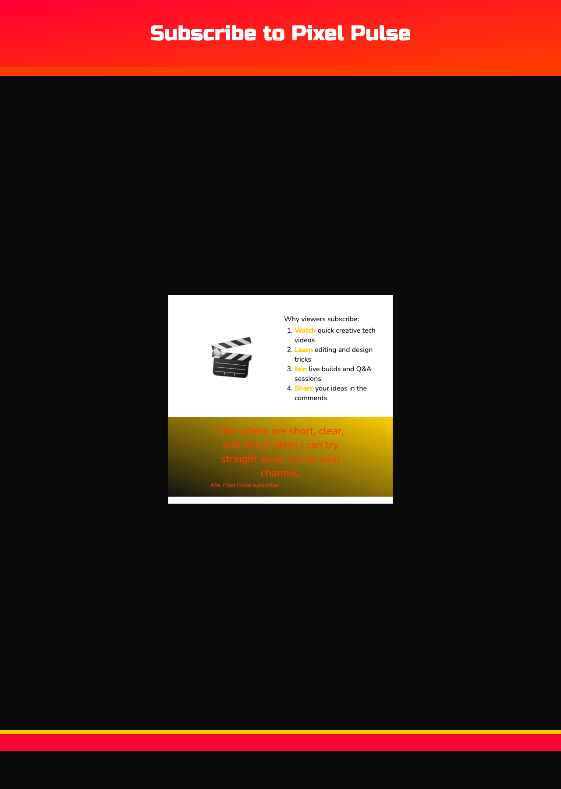

<h2 class="c-project-heading--task">Choose the colours and fonts</h2>

Update the CSS variables so the page uses a YouTube-inspired red, black, white, and orange colour theme.

<h2 class="c-project-heading--explainer">Follow these instructions</h2>

Open `default.css` from the file list next to `index.html`, then change these values.

--- code ---
---
language: css
filename: default.css
line_numbers: true
line_number_start: 1
line_highlights: 5-14,16-19
---

/* Set up colour palette and fonts using variables */

:root {
  --primary: #ffffff; /* Use white for the main content background */
  --secondary: #ff0033; /* Use a bright red for eye-catching sections */
  --tertiary: #111111; /* Add a dark neutral for contrast */
  --page: #0a0a0a; /* Make the page background almost black */
  --onprimary: #111111; /* Use dark text on light backgrounds */
  --onsecondary: #ffffff; /* Keep text readable on the red background */
  --ontertiary: #ffffff; /* Keep text readable on the dark background */
  --onpage: #ffffff;
  --detail: #ff3d00; /* Use orange-red for borders and highlights */
  --detail2: #ffcc00; /* Add a warm yellow accent */

  --body-font: 1rem 'Nunito', sans-serif; /* Set the main body font */
  --header-font: lighter 3rem 'Russo One', sans-serif; /* Give the heading a bold display font */
  --title-font: lighter 1.5rem 'Nunito', sans-serif;
  --quote-font: lighter 1.5rem 'Nunito', sans-serif;
}
--- /code ---

## Now run your code

Your page should now use the new channel colours and fonts, even though the layout is still simple.

### Tip

  <strong>Tip:</strong> Try changing the colours again later to make your own version of the landing page theme.

