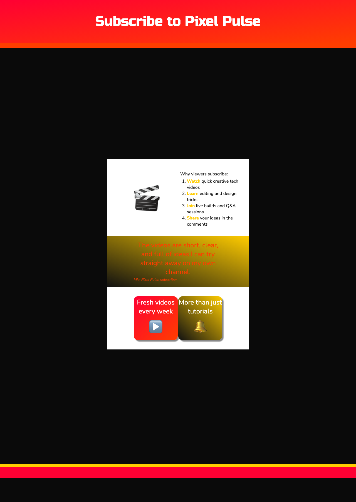

<h2 class="c-project-heading--task">Add YouTube flip cards</h2>

Add two flip cards that reveal highlights from your YouTube channel when the visitor hovers over them.

<h2 class="c-project-heading--explainer">Follow these instructions</h2>

Paste this section after the quote and just before `</main>` in `index.html`.

--- code ---
---
language: html
filename: index.html
line_numbers: true
line_number_start: 53
line_highlights: 55-67,69-81
---
      </section>

      <section class="wrap">
        

          

            

              <h2>Fresh videos every week</h2>
              
▶️
 <!-- Front of the first card -->
            

            

              
📅

              
NEW UPLOADS EVERY FRIDAY
 <!-- Back of the first card -->
            

          

        

        

          

            

              <h2>More than just tutorials</h2>
              
🔔
 <!-- Front of the second card -->
            

            

              
🎥

              
SHORTS, LIVESTREAMS, AND CHALLENGES
 <!-- Back of the second card -->
            

          

        

      </section>
    </main>
--- /code ---

## Now run your code

Two new cards should appear under the quote, and each one should show a different channel message when you hover over it.

