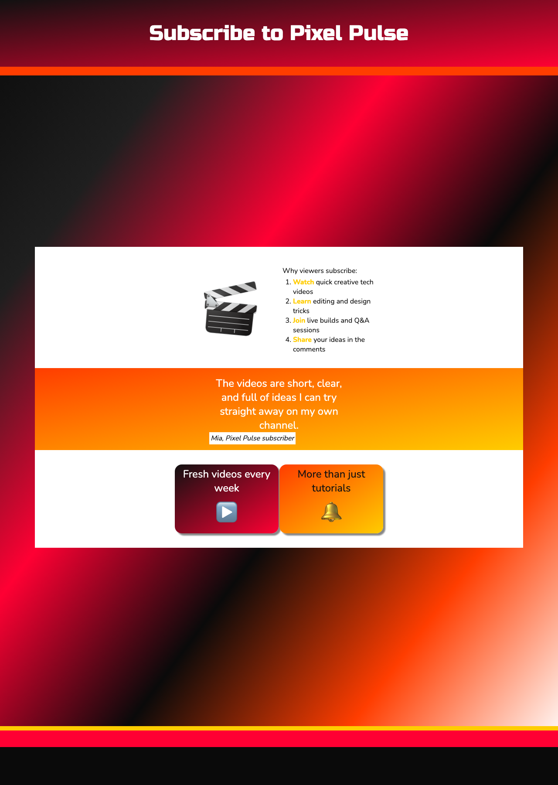

<h2 class="c-project-heading--task">Style the final layout</h2>

### Step 1
Update the page styles so the background and flip cards match the finished YouTube channel design and still fit neatly inside the project embed.

Open `style.css`. There is a lot of existing CSS in this file, so only change the highlighted lines in the selectors shown below.

--- code ---
---
language: css
filename: style.css
line_numbers: true
line_number_start: 44
line_highlights: 57-58,80,179-180,186,188,195,197,208,214,218,223,225,230-233,249-250,252,257-259,261,270,300-310
---
/* add a background image to body */

body {
  /*background-image: url('name.jpg');*/ /* Uncomment and change filename to add a background image */
  /*background-repeat: repeat;*/ /* Make the image repeat */
  /*background-size: cover;*/ /* Make the image cover the whole container */
}

/* The main content of the page between the header and footer */
main {
  background: var(--primary); /* Colour the background */
  color: var(--onprimary); /* Colour the text */
  margin: 0 auto; /* Center if the browser is really wide */
  width: 100%; /* Let the content fill the available space */
  min-width: 0; /* Allow the layout to shrink inside embeds */
  max-width: 70rem; /*  Don't let the content get too wide */
  padding: 0;
  padding-top: 0.5rem; /* Padding at the top */
  margin-bottom: 1em; /* Gap before the footer */
}

/* Header and footer element styles */

header,
footer {
  text-align: center;
  width: 100%; /* Fill the full width of the window */
  margin: 0; /* Remove the default margin */
  min-height: 3rem;
  padding-top: 1rem;
  padding-bottom: 1rem;
}

/* Section styles */

section {
  padding: 1rem; /* Keep enough space without forcing overflow */
  margin: 1rem auto;
}

/* Border styles */

.border-bottom {
  border-bottom: 20px solid var(--detail); /* Add a solid */
}

.border-top {
  border-top: 10px solid var(--detail2); /* Add a solid line above the footer */
}

/* Add a transparent effect */

.transparent {
  opacity: 0.95;
}

/* Styles just for h1 elements */

h1 {
  font: var(--header-font); /* Font style stored in the header-font variable */
  padding: 2rem;
  margin: 0; /* Center if the browser is really wide */
}

/* Styles just for h2 elements */

h2 {
  font: var(--title-font); /* Font style stored in the title-font variable */
}

/* Highlight key words in bold and apply an alternative text colour */

strong {
  color: var(--detail2); /* Text colour stored in the caption variable */
  font-weight: bold; /* Makes text weight stronger than the default*/
}

/* Style for ordered and unordered lists */

ol,
ul {
  display: inline-block;
  text-align: left;
  padding-left: 2rem;
}

/* Padding around paragraphs */

p {
  padding: 0.25rem 0.5rem;
}

/* Style for links */

a:link,
a:visited {
  font-weight: bold;
  color: inherit; /* Use the colour of the parent element */
}

.xcenter {
  text-align: center;
}

.ycenter {
  display: flex;
  justify-content: center;
  flex-flow: column;
}

/* Styles just for the .wrap class */

.wrap {
  /* Make content wrap over mutiple rows */
  display: flex;
  flex-wrap: wrap;
  justify-content: center;
  align-items: center;
  box-sizing: border-box;
  gap: 0rem 0rem; /* horizontal and vertical gap */
}

/* For creating fancy boxes */

.dashed-border {
  border: 0.25rem dashed var(--detail2);
}

.solid-border {
  border: 0.25rem solid var(--detail2);
}

/* Styles for the div tags that are inside a .wrap class */

.wrap > div {
  width: min(14rem, 100%); /* Keep wrapped blocks inside narrow embeds */
  padding: 0rem;
}

/* Styles for the img tags that are inside a .wrap class */

.wrap > img {
  width: min(14rem, 100%); /* Let wrapped images shrink on smaller screens */
  display: block;
  padding: 0rem;
}

/* Styles for the p tags that are inside a .wrap class */

.wrap > p,
.wrap > span {
  width: min(14rem, 100%); /* Let text blocks shrink instead of overflowing */
  display: block;
  padding: 0rem;
}

/* Specific styles for this project */

.bigfont {
  font-size: 3rem;
}

.hugefont {
  /* Used to make a large emoji */
  font-size: 8rem;
  text-align: center;
  padding: 1rem;
}

.wrap .narrow {
  width: min(10rem, 100%); /* Keep narrow blocks responsive */
}

.wrap .wide {
  width: min(20rem, 100%); /* Stop the quote block overflowing in embeds */
}

blockquote {
  font: var(--quote-font);
  color: var(--ontertiary);
  text-align: center;
  padding: 0.2rem;
  max-width: 25rem;
}

cite {
  color: var(--onprimary);
  background-color: var(--primary);
  font-size: normal;
  padding: 0.2rem;
}

/* Specific styles for this project */

.tile {
  height: 9.4rem;
}

.rounded {
  border-radius: 1rem;
}

.gradient1 {
  background-image: linear-gradient(
    to bottom right,
    #111111,
    #ff0033
  );
  color: #ffffff;
}

.gradient2 {
  background-image: linear-gradient(
    to bottom right,
    #ff3d00,
    #ffcc00
  );
  color: #111111;
}

.shadow {
   box-shadow: 5px 5px 3px 0px #888888; /* right and bottom shadow size, blur, spread and colour */
   /*box-shadow: 5px 5px 4px 2px var(--detail);*/
}

.wrap .card {
  width: min(15rem, 100%); /* Keep cards responsive in narrow embeds */
  height: 10rem;
  border: 0.1rem solid transparent;
}

.card-content {
  position: relative;
  width: 100%;
  height: 100%;
  text-align: center;
  transition: transform 1s;
  transform-style: preserve-3d;
  perspective: 60rem;
}

.card:hover .card-content {
  transform: rotateY(180deg);
}

.card-face {
  position: absolute;
  width: 100%;
  height: 100%;
  backface-visibility: hidden;
}

.card p {
  padding: 0.5rem;
}

.gradientCP {
  background-image: linear-gradient(
    to bottom right,
    #0a0a0a,
    #1f1f1f,
    #ff0033,
    #0a0a0a,
    #ff3d00,
    #ffffff
  );
  color: #ffffff;
}

/* Printed photo style */
--- /code ---

### Step 2
**Test:** The page background should look more like a video channel banner, the layout should fit neatly inside the project embed, and the flip cards should still work.

