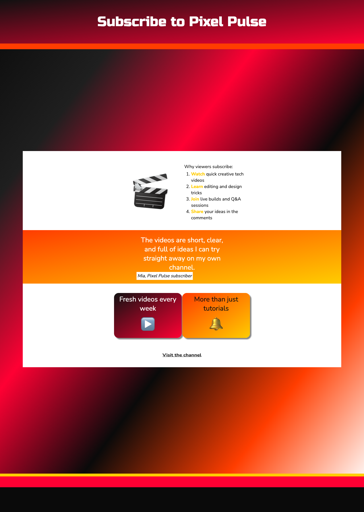

## Add a call-to-action link

Add a final link that gives visitors a clear way to visit the YouTube channel.

Paste this section just before `</main>` in `index.html`.

```html filename="index.html" line_numbers="true" line_number_start="81" line_highlights="83-85"
      </section>

      <section class="xcenter">
        <a class="bounceme" href="https://www.youtube.com" target="_blank">Visit the channel</a> <!-- Send visitors to YouTube -->
      </section>
    </main>
```

## Now run your code

A `Visit the channel` link should appear at the bottom of the page and open YouTube in a new tab.


