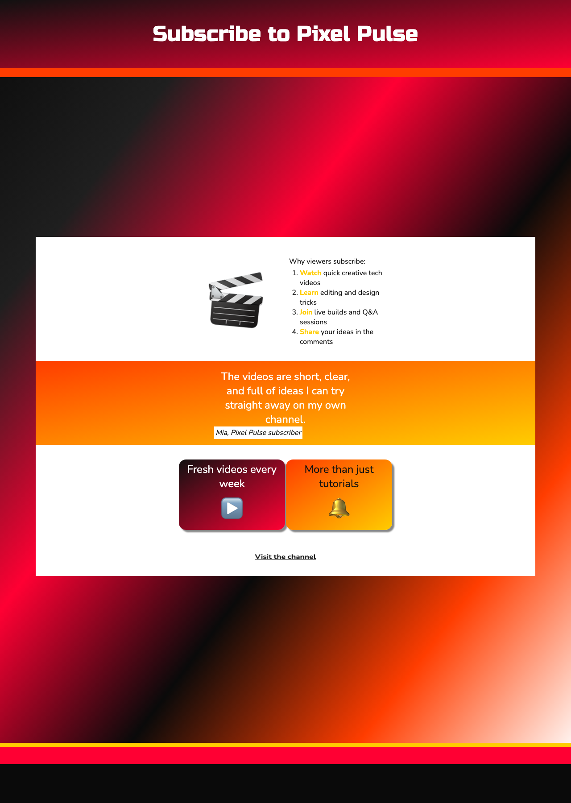

<h2 class="c-project-heading--task">Refine the animation</h2>

Adjust the animation settings so the channel emoji and link keep moving gently while the cards flip smoothly.

<h2 class="c-project-heading--explainer">Follow these instructions</h2>

Open `animation.css` and only change the highlighted lines. Leave the other animation classes in place.

--- code ---
---
language: css
filename: animation.css
line_numbers: true
line_number_start: 1
line_highlights: 2-3,7,18,31,39,44,49,52,55,70,74,86,90
---
.spinme {
  animation: rotate-center linear 8s infinite; /* Keep the channel emoji spinning all the time */
  display: inline-block; /* Important to allow rotation */
}

@keyframes rotate-center {
  /* The spin me animation code */
  0% {
    /* Rotate from 0 to 360 degrees */
    transform: rotate(0);
  }
  100% {
    transform: rotate(360deg);
  }
}

.bounceme {
  animation: bounce ease 2s infinite; /* Keep the channel link bouncing so it stands out */
  display: inline-block;
}

@keyframes bounce {
  /* The bounce animation code */
  0% {
    transform: scale(1, 1) translateY(0); /* Starting position and actual size */
  }
  10% {
    transform: scale(1.1, 0.9) translateY(0); /* Grow width and shrink height for pre bounce squash effect */
  }
  30% {
    transform: scale(1, 1) translateY(-1rem); /* Use a small bounce so the text stays readable */
  }
  50% {
    transform: scale(1, 1) translateY(0); /* Move emoji back to starting position */
  }
}

.scaleme {
  animation: scale ease 2s infinite; /* Keep scaling effects looping smoothly */
  display: inline-block;
}

@keyframes scale {
  /* The twinkle animation code */
  0% {
    transform: scale(1, 1);
  }
  20% {
    transform: scale(1.05, 1.05);
  }
  40% {
    transform: scale(1.1, 1.1); /* Peak size for the animation */
  }
  60% {
    transform: scale(1.05, 1.05); /* Shrink back down smoothly */
  }
  80% {
    transform: scale(1, 1);
  }
}

.rollmeleft {
  animation: rollleft ease 8s 1;
  display: inline-block;
}

@keyframes rollleft {
  /* The roll animation code */
  from {
    transform: translate(-60vw) rotate(0deg); transform-origin: center; /* Rotate around the middle of the element */
  }

  to {
    transform: translate(0vw) rotate(360deg); transform-origin: center;
  }
}

.rollmeright {
  animation: rollright ease 8s 1;
  display: inline-block;
}

@keyframes rollright {
  /* The roll animation code */
  from {
    transform: translate(60vw) rotate(360deg); transform-origin: center; /* Rotate around the middle of the element */
  }

  to {
    transform: translate(0vw) rotate(00deg); transform-origin: center;
  }
}

.movemeleft {
  animation: moveleft ease 8s 1;
  display: inline-block;
}

@keyframes moveleft {
  /* The move animation code */
  from {
    transform: translate(-60vw);
  }

  to {
    transform: translate(0vw);
  }
}

.movemeright {
  animation: moveright ease 8s 1;
  display: inline-block;
}

@keyframes moveright {
  /* The move animation code */
  from {
    transform: translate(60vw);
  }

  to {
    transform: translate(0vw);
  }
}

.flipme {
  transform: rotateY(180deg);
}
--- /code ---

## Now run your code

The emoji should spin continuously, the `Visit the channel` link should keep bouncing, and the flip cards should still work.

