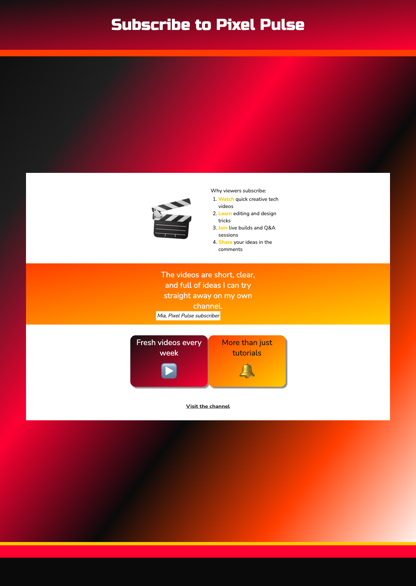

<h2 class="c-project-heading--task">Challenge: make your landing page</h2>

Add your own extra feature to make the landing page even more persuasive or interactive.

<h2 class="c-project-heading--explainer">Follow these instructions</h2>

Try one of these ideas:

- Add another flip card with a new channel feature.
- Add a second quote from a subscriber.
- Change the background gradient to make a different mood.
- Add an image or emoji that uses one of the starter animation classes.

## Now run your code

Your new feature should be visible on the page and should fit with the style of the rest of the design.

